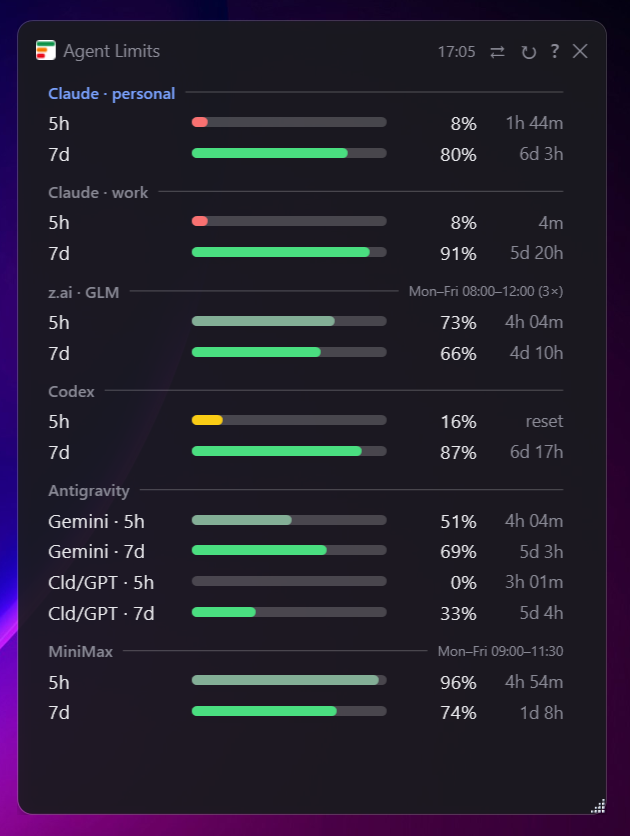

# AgentLimits

> A small always-on-top tray widget that shows how much quota is left across all your AI coding CLIs, in one glance.


## Why

Every AI coding assistant shows its remaining quota in a different place: Claude Code has a
`/usage` screen, Antigravity has a `/usage` slash command inside its TUI, GLM/z.ai has a web
dashboard, Codex has a line in `/status`. Figuring out which one still has headroom for today's
work means opening four different places, three of them outside the terminal.

AgentLimits collects all of that into one small rectangle in the corner of the screen. It lives
in the tray, opens with a click on the icon, and stays on top until you dismiss it.

Polling never costs you quota — none of the sources are billed for being asked about their own
limits.

## Features

**Six sources out of the box.** Claude Code in two profiles (personal and work, each with its own
account), GLM/z.ai, Codex CLI, Antigravity (four windows: weekly and 5-hour for both the Gemini
pool and the Claude/GPT pool), and MiniMax.

**Extensible without rebuilding.** Don't see your model? Drop a small Python script into the
plugins folder — no compilation, no framework. See [Writing a plugin](#writing-a-plugin) below.

**Never shows a false zero.** If a source fails to respond, its row keeps the last known value and
marks it stale instead of going blank. An empty row would read as "quota exhausted," which is the
opposite of the truth.

**Weekly quota stands out.** Weekly windows are drawn in full color, 5-hour windows are dimmed —
the weekly number is the one that actually constrains your day. Yellow and red warnings are never
dimmed, they're always a signal.

**Toggle remaining vs. used.** Some providers report what's left, others report what's spent; one
click in the header switches the whole widget to match whichever convention you're used to.

**Local MCP server.** AgentLimits can expose the same data to other MCP-aware agents over
`http://localhost:8765/mcp` (JSON-RPC 2.0), so a coding agent can check its own remaining headroom
before starting a long task.

**Starts with Windows**, if you enable it from the tray menu.

## Screenshots



## Quick start

Requires the [.NET 10 SDK](https://dotnet.microsoft.com/download) and Windows.

```cmd
git clone https://github.com/ultrathinker/AgentLimits.git
cd AgentLimits
dotnet build -c Release
bin/Release/net10.0-windows/AgentLimits.exe
```

Check what the collectors see without opening the window:

```cmd
cd tools/Probe
dotnet run
```

## Configuring built-in sources

Claude Code, Codex and Antigravity are picked up automatically from their existing local
credentials — no setup needed if you're already logged into those CLIs.

GLM/z.ai and MiniMax need an API token, stored encrypted (Windows DPAPI, current-user scope) so it
never touches disk in plaintext:

```powershell
tools\set-zai-token.ps1 -TokenFile path\to\token.txt
tools\set-minimax-token.ps1 -TokenFile path\to\token.txt
```

The token file is deleted after a successful write.

## Writing a plugin

AgentLimits ships with a full plugin-authoring guide meant to be pasted straight into an AI
assistant ("add a block for X"). It's the single source of truth for the format and is also shown
in-app under **Help → Plugin Authoring Guide**; you can read the same text directly in
[`PluginGuide.cs`](PluginGuide.cs). A minimal worked example lives in
[`examples/openrouter`](examples/openrouter).

In short: a plugin is a Python script that prints one JSON object to stdout on a timer — no HTTP
server, no dependencies beyond the standard library, one-click approval on first run.

## Stack

- C# 14, .NET 10 (`net10.0-windows`)
- WPF for the widget, Windows Forms only for the tray icon
- Zero NuGet packages — JSON, HTTP, DPAPI and GDI+ all come from the platform
- P/Invoke: `iphlpapi.dll` (process ports), `crypt32.dll` (token encryption), `user32.dll` and
  `kernel32.dll` (window/cursor/icon handling)

## Contributing

Issues and pull requests are welcome — there's no separate contributing guide, just open one.

## License

[MIT](LICENSE)
